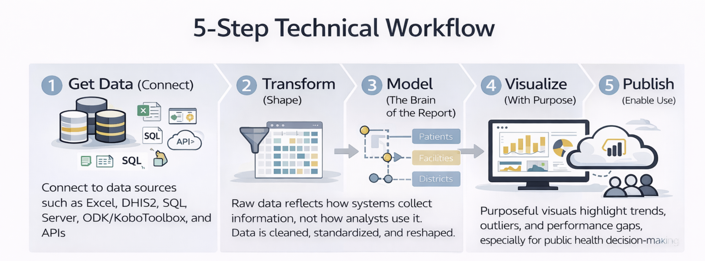

# From Question to Dashboard (Mindset)

A common mistake beginners make is opening Power BI and immediately trying to draw charts. The tool makes it easy to drag fields onto visuals, it feels intuitive, fast, and rewarding.

Unfortunately, this instinct is the primary reason public health dashboards fail.

Dashboards built "visuals-first" may look impressive during a demo, but they are often fragile. They fail to answer meaningful questions, they break when next month's data arrives, and they require complete rebuilding when a stakeholder asks for a simple
change.

Effective data use requires a fundamental shift in mindset. Power BI rewards **structure before style**.

----------------------------------------------------------------------------------------------------------------------------------------------------------------------------------------------------------------------------------------------------------------

## Data Use Starts with Questions, Not Charts

Power BI is not a charting tool. It is a decision-support tool.

In the rush to visualize, analysts often skip the most important step: ***defining the purpose***. Before you connect to a single data source, you must pause to ask:

-   **What decision needs to be made?** (e.g., allocating mobile clinics, ordering ARV stock, hiring staff)
-   **Who needs to make that decision?** (e.g., District Health Officer, M&E Manager, Donor)
-   **What information would change their action?**

In Monitoring and Evaluation (M&E) and Public Health, these questions are rarely abstract. They are practical, high-stakes, and time-bound:

-   *“Are we on track to meet the UNAIDS 95-95-95 targets in the Northern Region?”*
-   *“Which facilities have a Lost-to-Follow-Up rate higher than 5% this quarter?”*
-   *“Is the drop in ANC visits seasonal, or is it a service delivery failure?”*

Dashboards exist to answer these questions. If a visual does not support a decision, it is noise.

----------------------------------------------------------------------------------------------------------------------------------------------------------------------------------------------------------------------------------------------------------------

## Indicators Come Before Dashboards

In development programs, **indicators** are the bridge between raw data and decisions.

In Excel, you might be used to creating a pivot table and calculating a percentage right there in the cell. If you need to change the definition, you edit the cell formula.

In Power BI, this approach is dangerous.

A useful workflow looks like this:

1.  Define the **Question**
2.  Define the **Indicator** (The Logic)
3.  Define the **Data Required** (The Ingredients)
4.  Build the **Dashboard** (The Surface)

Skipping directly to dashboards reverses this logic. It forces you to build logic *inside* the visual, which creates "Implicit Logic."

### The Danger of "Implicit Logic"

Implicit logic happens when you define an indicator using filters on a specific chart rather than a global formula.

> **Case Study: The "Retention Rate" Trap**
>
> Imagine you want to show the **Retention Rate** for HIV patients.
>
> -   **The Visuals-First Approach:** You drag a count of patients to a bar chart. You drag a filter to the side and uncheck "Transferred Out" and "Dead." You rename the chart title to "Retention."
>     -   *The Risk:* Next week, a colleague copies that chart but forgets to copy the filters. Or, they add a filter for "Age \< 15." Suddenly, the two charts show different numbers for the same metric. There is no single "truth"(only different views).
> -   **The Indicators-First Approach:** You write a **DAX Measure**. You explicitly define the math: `Retention Rate = DIVIDE( [Active Patients], [Total Enrolled] - [Transferred Out] )`
>     -   *The Reward:* This definition is now hard-coded into the model. Whether you put it on a map, a card, or a table, it always calculates correctly. You have created a **Single Source of Truth**.

For the M&E professional, "Viral Load Suppression" is not a chart. It is a strict definition. Once that definition is clear, Power BI can calculate it consistently across time, geography, and disaggregation.

This is why **modeling and calculations matter more than visuals**.

----------------------------------------------------------------------------------------------------------------------------------------------------------------------------------------------------------------------------------------------------------------

## The Concept-to-Canvas Workflow

***1. Define the Question (The Strategic Layer)*** Don't ask "What data do we have?" Ask "What do we need to know?" \* *Bad Start:* "I have a CSV of malaria cases." \* *Good Start:* "We need to identify districts where malaria incidence is rising despite
bed net distribution."

***2. Define the Indicator (The Logic Layer)***

Treat this like a laboratory protocol. It must be reproducible. In M&E, this usually involves defining a **Numerator** and a **Denominator**.

-   **Indicator:** Viral Load Suppression Rate.
-   **Numerator:** Number of patients with VL \< 1000 copies/ml.
-   **Denominator:** Total number of patients with a documented VL result.
-   **Nuance:** Does "documented result" mean within the last 12 months? Does it include children? These rules must be written down *before* you build.

***3. Define the Data Required (The Data Layer)***

Now that you know the formula, identify the ingredients.

-   Do you need the `lab_results` table from the LIMS?
-   Do you need the `patient_demographics` table from the EMR?
-   Do you need to join them on `PatientID`?
-   Do these tables speak the same language? (e.g., does one use "M/F" and the other "Male/Female"?)

***4. Build the Dashboard (The Visual Layer)*** Only now, after steps 1–3, do you open the Power BI canvas. Because you have defined the indicator, you know exactly what measures to write. The visuals become simple containers for your logic.

----------------------------------------------------------------------------------------------------------------------------------------------------------------------------------------------------------------------------------------------------------------

## The 5-Step Technical Workflow

Once you have your plan, Power BI follows a technical workflow that mirrors good analytical practice.

### 1. Get Data (Connect)

This step answers one question: *Where does the data live?* Data may come from Excel, DHIS2, SQL Server, ODK/KoboToolbox, or APIs. At this stage, the goal is **access**, not perfection. In public health, data is often fragmented across multiple systems;
your first task is simply to bring it into the Power BI kitchen.

### 2. Transform (Shape)

Raw data reflects how systems *collect* information, not how analysts *use* it. Common public health data issues include:

-   **"Wide" Data:** Months spread across columns (Jan, Feb, Mar) instead of rows.
-   **Dirty Data:** "District A" and "Dist. A" treated as different places.
-   **Missing Headers:** Cryptic codes like `var_001` instead of `Diagnosis`.

In Excel, you might fix these manually every month. In Power BI, you use **Power Query** to record these steps. This ensures that next month, when the new data arrives, the cleaning happens automatically.

### 3. Model (The Brain of the Report)

The data model is where the magic happens. It determines what questions your dashboard can answer. You define relationships between tables:

-   Patients belong to Facilities.

-   Facilities belong to Districts.

-   Results belong to Time Periods.

A strong model allows you to slice a single indicator (like *"Positivity Rate"*) by any dimension (*Age*, *Sex*, *Location*, *Time*) without writing new formulas. This is the superpower of Power BI compared to Excel.

### 4. Visualize (With Purpose)

Visualization is the tip of the iceberg. It is the only part the user sees, but it relies entirely on the model beneath it.

Good visuals in Public Health are functional, not decorative. They should:

-   **Answer the question:** What is the HIV prevalence in a specified populations?
-   **Highlight outliers:** Which facility is failing?
-   **Show trends:** Is the epidemic curve flattening?
-   **Enable drill-down:** Click on a province to see its districts.

### 5. Publish (Enable Use)

A dashboard that lives on your desktop is useless. Publishing involves sharing the report to the Power BI Service, setting up automated data refreshes (so you don't have to email files), and managing security (so the right people see the right data).

----------------------------------------------------------------------------------------------------------------------------------------------------------------------------------------------------------------------------------------------------------------

## The M&E Mindset Shift

This workflow requires a deliberate shift in thinking. The table below outlines how your approach must change when moving from Excel to Power BI.

| Feature          | Old Mindset (Excel)                                 | New Mindset (Power BI)                                                   |
|:-----------------|:----------------------------------------------------|:-------------------------------------------------------------------------|
| **Goal**         | "I need to make a chart for the donor."             | "I need to build a model that answers donor questions."                  |
| **Formulas**     | Logic is hidden in cell formulas (e.g., `=C2/D2`).  | Logic is explicit in named Measures (e.g., `[New Positives] / [Tests]`). |
| **Data Updates** | New data requires manual copy-pasting and checking. | New data flows through an automated pipeline.                            |
| **Filtering**    | Filters are applied to specific charts or rows.     | Filters propagate through relationships in the data model.               |
| **Outcome**      | **Fragile & One-off**                               | **Robust & Scalable**                                                    |

----------------------------------------------------------------------------------------------------------------------------------------------------------------------------------------------------------------------------------------------------------------

## A Simple Mental Checklist

Before building any dashboard, ask yourself:

1.  **Question:** Do I know what decision this supports?
2.  **Definition:** Can I write the formula for the indicator on a whiteboard?
3.  **Data:** Is the raw data accessible and consistent?
4.  **Model:** Will this model survive if the user asks for a new disaggregation?

If the answer to any of these is no, the solution is not another chart. It is to step back and plan.

**What to Carry Forward**

This book follows this exact workflow:

-   **Questions before dashboards.**

-   **Structure before style.**

-   **Reuse before reinvention.**

The next chapter moves into the first technical step: connecting Power BI to common data sources used in M&E and public health programs.
