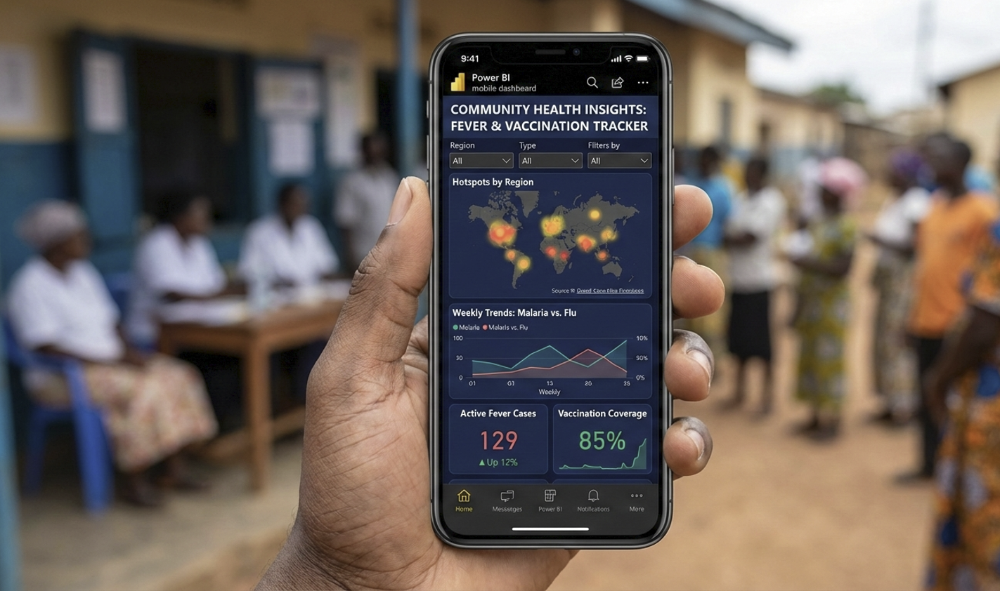

# Understanding the Power BI Ecosystem

Power BI isn't just a single program. It is a **collection of tools**,
each designed for a specific role in the data life cycle.

Honestly, most frustrations with Power BI come from not understanding
this separation. You often see analysts trying to share files directly
from Desktop, stakeholders expecting to edit reports in the Service, or
teams completely underestimating the importance of the Gateway.

This chapter gives you a clear mental model of how the ecosystem works
and how the components fit together in real-world M&E and public health
workflows.

At a high level, the ecosystem separates:

-   **Development**
-   **Distribution**
-   **Consumption**

------------------------------------------------------------------------

## Power BI Desktop (The Kitchen)

Power BI Desktop is a **free Windows application** where the technical
work happens.

-   **Primary role:** Authoring and development
-   **Who uses it:** Data analysts, M&E officers, data managers
-   **Typical tasks:**
    i.   Connecting to data sources
    ii.   Cleaning and transforming data with Power Query
    iii.   Building data models and relationships
    iv.   Writing DAX calculations
    v.   Designing report pages

Think of Power BI Desktop as the **Kitchen**.

This is where ingredients are prepared and recipes are tested. It is
**not** designed for end users. When too many people work directly in
the Desktop file, version control breaks down and consistency is lost.

When you first open Power BI Desktop, you are presented with the main
report canvas and common data connection options.

{width=100%}

> **Note:** Treat Power BI Desktop as a controlled environment. Fewer
> authors and stronger standards lead to more reliable dashboards.

------------------------------------------------------------------------

## Power BI Service (The Restaurant)

The Power BI Service is the **cloud-based platform** accessed through a
web browser.

-   **Primary role:** Distribution and collaboration
-   **Who uses it:** Program managers, technical leads, leadership,
    partners
-   **Typical tasks:**
    i.   Publishing reports from Desktop
    ii.   Scheduling data refreshes
    iii.   Managing users and permissions
    iv.   Creating dashboards from reports
    v.   Sharing content securely

The Service is the **Restaurant**.

Stakeholders come here to consume data. They can filter, drill down, and
interact with visuals, but they cannot change the underlying
calculations or data structures. This separation protects data integrity
while still encouraging exploration.

{width=100%}

------------------------------------------------------------------------

## Power BI Mobile (The Takeout)

Power BI Mobile consists of native applications for **Android and iOS**
devices.

-   **Primary role:** Quick access and field-level consumption
-   **Who uses it:** Field officers, supervisors, roving program staff
-   **Typical tasks:**
    i.   Viewing dashboards optimized for small screens
    ii.   Checking trends before meetings or site visits

This is the **Takeout** experience.

In decentralised programs, mobile access allows teams to engage with
data closer to the point of service delivery rather than waiting to get
back to the office. 

{width=100%}

------------------------------------------------------------------------

## The Power BI Gateway (The Bridge)

Many development and public health organisations rely on **on-premise
systems**, including:

-   Local SQL databases
-   DHIS2 instances hosted within private government networks
-   EMRs deployed at the facility or state level

The Power BI Gateway acts as a secure bridge between these systems and
the Power BI Service.

-   It enables automated refresh from internal data sources.
-   It runs inside the organisation’s network.
-   It prevents direct exposure of databases to the internet. 

{width=100%}

> **Note:** Gateway misconfiguration is one of the most common reasons
> dashboards fail after deployment. Plan for this early.

------------------------------------------------------------------------

## How the Ecosystem Works in Practice

A typical workflow looks like this:

1.  Data is connected, cleaned, and modeled in **Power BI Desktop**.
2.  The report is published to the **Power BI Service**.
3.  A **Gateway** refreshes data on a schedule (if the data is
    on-premise).
4.  Stakeholders access dashboards via the **Service or Mobile app**.

{width=100%}

> **Note** Each component has a defined responsibility. Respecting these
> boundaries keeps systems stable and scalable.

------------------------------------------------------------------------

## Common Misunderstandings to Avoid

-   Treating Power BI Desktop as a sharing tool (don't email .pbix
    files).
-   Allowing many people to independently rebuild the same report.
-   Ignoring gateway planning until deployment.
-   Expecting mobile apps to replace full dashboards.

Understanding these limits early prevents frustration later.

------------------------------------------------------------------------

## What to Remember from This Chapter

-   Power BI Desktop is for **building and modeling**.
-   Power BI Service is for **sharing and collaboration**.
-   Power BI Mobile supports **field-level access**.
-   The Gateway enables **secure, automated refresh**.

Once this ecosystem is clear, Power BI becomes much easier to learn and
use effectively.

**The next chapter focuses on connecting **Power BI to common data sources** used in M&E and public health programs.**
