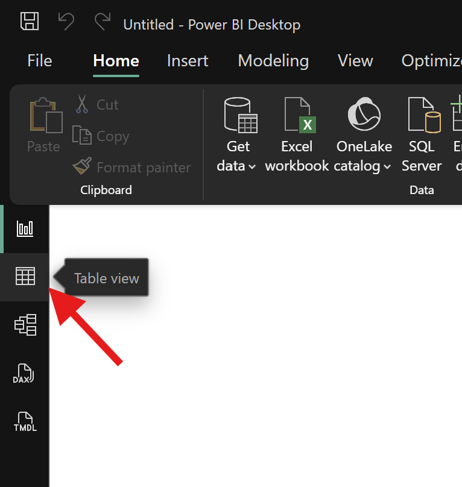

# Connecting to Common Data Sources

Power BI Desktop can connect to hundreds of different data sources, but most Monitoring and Evaluation and Public Health workflows rely on a small and predictable subset.

The **Get Data** button on the Home ribbon is always the starting point. However, effective use of Power BI is less about knowing *every* connector and more about knowing **which connector to use in a given situation**.

In this chapter, we will connect Power BI to the **integrated sample datasets used throughout this book** and build confidence before we begin cleaning and modeling the data.

## Before You Begin: The Sample Dataset Used in This Book

All practical exercises in this guide use a **synthetic, patient-level integrated health dataset** generated specifically for learning.

The dataset represents routine service delivery across:

- Antenatal Care (ANC)
- HIV and ART
- Malaria
- Tuberculosis (TB)
- Non-Communicable Diseases (NCDs)

No real patient data is used.

### Files Included

You should have the following CSV files available:

- `dim_patient.csv`
- `dim_facility.csv`
- `dim_date.csv`
- `fact_patient_visits.csv`

These files are intentionally **not clean**. They contain common data quality issues that reflect real health information systems. We will address these issues in later chapters.

For now, focus only on **connecting the data successfully**.

## File-Based Data Sources

File-based data is the most common entry point for M&E professionals and is how we will begin.

All sample datasets used in this book are provided as **CSV files**, making them easy to import and reuse.

### Practical Exercise 4.1: Importing the Integrated Health Fact Table

**Objective:** Connect Power BI to the main patient-level fact table.

**Steps:**

1. Open Power BI Desktop  
2. Click **Get Data → Text/CSV**  
3. Select `fact_patient_visits.csv`  
4. Review the data preview  
5. Click **Load**

To import a CSV file, use the **Get Data** menu and select the **Text/CSV** option.

**What to Observe:**

- The number of rows loaded
- Yes/No fields with inconsistent formatting
- Date fields that appear as text
- Missing or unexpected values

To view the imported data, click the **Table View** icon on the left sidebar.

Do **not** attempt to fix anything yet. We will address these issues in the next chapter.

### Practical Exercise 4.2: Importing Dimension Tables

**Objective:** Import supporting dimension tables used for analysis.

Repeat the steps above for each of the following files:

- `dim_patient.csv`
- `dim_facility.csv`
- `dim_date.csv`

You should now have **four tables** loaded into Power BI.

**Reflection:**

As you review the imported tables, consider:

- Which tables contain unique records?
- Which tables are primarily descriptive?
- Which table contains repeated transactional records?
- Which fields look suitable for relationships?

These questions will become important in the modeling chapter.

## Understanding Why CSV Is Used Here

CSV files are widely used for data exchange in public health systems, including exports from:

- **DHIS2**
- **EMRs**
- **KoboToolbox and ODK**
- **Laboratory systems**

They are lightweight, consistent, and ideal for automation, but they often contain:

- Formatting inconsistencies
- Missing values
- Invalid dates
- Mixed data types

Power BI is designed to handle these challenges when used correctly.

## The Folder Connector (Optional but Powerful)

In real-world reporting, data is often received periodically, such as:

- Monthly extracts
- Quarterly program reports
- Routine facility submissions

The **Folder connector** allows Power BI to combine multiple files with the same structure automatically.

### Practical Exercise 4.3: Exploring the Folder Connector (Optional)

**Objective:** Understand how Power BI handles multiple files.

**Setup (Optional):**

- Create a folder on your computer
- Copy `fact_patient_visits.csv` into it multiple times
- Rename the copies (for example: `Jan_visits.csv`, `Feb_visits.csv`)

**Steps:**

1. Click **Get Data → Folder**  
2. Select the folder  
3. Click **Combine and Transform**

**Reflection:**

- Review the combined data preview
- Observe how Power BI applies the same steps to each file
- Note how this approach supports ongoing reporting

We will not use this method for the main exercises, but it is important to understand.

## Database and Online Sources (Context Only)

As programs scale, data may be stored in:

- SQL databases
- Cloud platforms
- APIs
- SharePoint Lists

Power BI supports these sources, often with the help of a gateway for secure refresh.

For now, we focus on file-based data to keep learning accessible and reproducible.

## Understanding Connection Modes

When importing the sample datasets, Power BI uses **Import mode** by default.

### Import Mode (Recommended)

- Data is copied into Power BI’s internal engine
- Performance is fast
- All features are available
- Ideal for most M&E and public health analysis

### DirectQuery Mode (Not Used Here)

DirectQuery keeps data in the source system and queries it live. While useful in some scenarios, it introduces complexity and limitations that are unnecessary for this guide.

> **Rule of thumb:**  
> If you are learning or unsure, use Import.

## Practice Summary

By the end of this chapter, you should have:

- Imported all four sample datasets
- Confirmed that data loads successfully
- Resisted the urge to clean or model prematurely

At this stage, the data may look messy. That is expected.

The next chapter focuses on **cleaning and transforming data using Power Query**, where we will systematically fix these issues and prepare the data for proper modeling and analysis.
