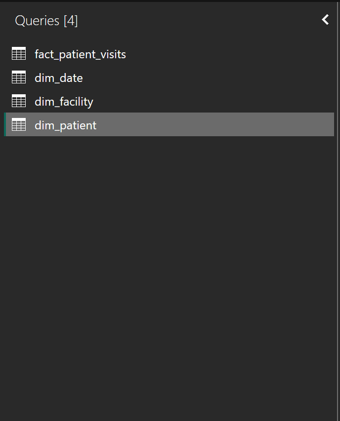
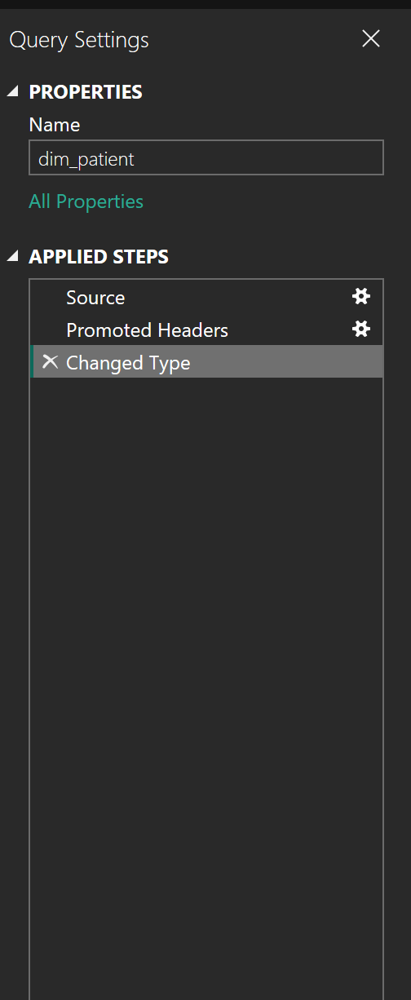

# Power Query Basics That Actually Matter

If Power BI is a house, Power Query is the foundation. If the foundation is weak, everything built on top of it will eventually fail.

In public health and development programs, most reporting problems are not caused by poor visuals. They are caused by inconsistent, fragile, or undocumented data preparation. Power Query exists to make data cleaning **explicit, repeatable, and defensible**.

This chapter focuses on the parts of Power Query that actually matter for reliable data use.

## Why Power Query Matters in Public Health Data

Health data is complex by nature. It comes from multiple systems, is collected by different actors, and often changes definitions over time. Missing values, placeholder codes, and inconsistent formats are common.

When these issues are handled manually in Excel, the logic is hidden. Hidden logic cannot be reviewed, reproduced, or trusted.

Power Query forces transparency.

Every transformation is recorded, ordered, and replayed exactly the same way every time data is refreshed. This is not convenience. It is **governance**.

## What Power Query Is (and Is Not)

Power Query is a **data transformation engine**.

When you click **Transform Data** in Power BI Desktop, you open the **Power Query Editor**, a dedicated environment for preparing data before analysis.

Power Query is:\
- Deterministic\
- Repeatable\
- Explicit

Power Query is **not**:\
- A visualization tool\
- A place to calculate indicators\
- A replacement for data modeling

Its purpose is singular:\
**turn raw, messy data into structured analytical inputs**.

## Understanding the Power Query Interface

The Power Query Editor has three areas that matter conceptually.

### The Ribbon

The ribbon contains buttons for common transformations such as:\
- Split Column\
- Group By\
- Replace Values\
- Change Data Type

These buttons do not directly clean data. They generate **steps**. The step matters more than the button.

```{=html}

```

### The Queries Pane

Each item in the Queries pane represents a dataset, referred to as a query.

In this book, these include:\
- `fact_patient_visits`\
- `dim_patient`\
- `dim_facility`\
- `dim_date`

At this stage:\
- Do not join queries\
- Do not calculate indicators\
- Do not optimize visuals

Think of each query as an ingredient being prepared independently.

```{=html}

```

### The Applied Steps Pane

This is the most important part of Power Query.

Every transformation is recorded as a step:\
- Source\
- Navigation\
- Changed Type\
- Removed Columns\
- Replaced Values

```{=html}

```

> Note: Together, these steps form a **data preparation contract**: This is exactly how raw data becomes analysis-ready.

> Deleting or reordering steps changes that contract.

## Why Power Query Feels Like “Magic”

In Excel, data cleaning is manual and repetitive. If you clean this month’s file, you must repeat the same work next month.

In Power Query, you are not cleaning data once. You are **recording logic**.

When new data arrives and you click **Refresh**, Power Query replays every applied step automatically. The same rules. The same order. The same results.

This is the difference between one-off reporting and sustainable monitoring.

## Power Query Thinking vs Excel Thinking

Excel encourages **manual correction**.

Power Query requires **logical definition**.

**In Excel:**

\- You fix a cell

\- The logic lives in your head

**In Power Query:**

\- You define a rule

\- The logic lives in the steps

If a fix cannot be described as a rule, it does not belong in Power Query.

## The Principle of Repeatable Cleaning

In Monitoring and Evaluation work, numbers must be defensible.

If someone asks, *“How did you arrive at this figure?”*, the answer should be a documented sequence of steps, not personal judgment.

Before applying any transformation, **ask**:\
- Will this still work if new rows are added?\
- Will this break if values change?\
- Can another analyst understand this step?

If the answer is no, rethink the approach.

## Query-Level vs Column-Level Cleaning

Not all cleaning decisions are equal.

Some issues affect the **entire dataset**, while others affect **specific columns**.

-   **Query-level cleaning** applies to the structure of the dataset\
    Examples include:
    -   Removing empty rows
    -   Filtering invalid records
    -   Renaming queries
-   **Column-level cleaning** applies to individual fields\
    Examples include:
    -   Standardizing Yes/No values
    -   Converting data types
    -   Replacing sentinel values

> A good rule of thumb:\
> - Structural problems belong at the query level while Meaning problems belong at the column level.

## Working With the Sample Dataset

This chapter focuses primarily on the `fact_patient_visits` table.

This dataset intentionally includes:\
- Inconsistent Yes/No values\
- Dates stored as text\
- Sentinel values such as `999`\
- Missing ART start dates and regimens

These are not errors. They reflect real system behaviour and are included to support learning.

## Understanding the Role of Each Table in Cleaning

Not all tables require the same level of cleaning, and not all issues should be handled in the same place.

In this project, the tables serve different purposes:

-   **`fact_patient_visits`**\
    Contains transactional records and is the primary source of complexity. Most cleaning effort happens here.

-   **`dim_patient`**\
    Contains relatively stable demographic attributes. Cleaning focuses on consistency and validity.

-   **`dim_facility`**\
    Mostly descriptive. Cleaning focuses on standardization rather than logic.

-   **`dim_date`**\
    Should be clean by design. Any issues here usually indicate upstream problems.

Understanding the role of each table helps you decide **what to clean, where to clean it, and what to defer**.

## Core Data Cleaning Patterns for Messy Health Data

### Setting Correct Data Types

This is the most common source of silent errors.

Data types determine what can be calculated, aggregated, and filtered correctly.

**Common issues include:** - Dates stored as text - Numeric values mixed with symbols - Boolean values recorded inconsistently

Always review the automatically generated **Changed Type** step. Do not assume Power BI guessed correctly.

### Exercise 5.1: Data Type Audit

**Objective:** Identify and correct incorrect data types.

**Steps:** 1. Open the Power Query Editor 2. Select the `fact_patient_visits` query 3. Review the data type icon beside each column 4. Identify at least three columns with incorrect data types 5. Explicitly set the correct data type

**Reflection:** - Which values became null after correction? - What does this reveal about source data quality?

### Standardizing Categorical Values

Health datasets often encode the same concept in multiple ways: - Yes, YES, Y, 1 - No, NO, N, 0

These differences matter in filters and calculations.

The goal is **one representation per concept**.

### Exercise 5.2: Standardizing Yes and No Fields

**Objective:** Normalize categorical values.

**Steps:**

1\. Choose a Yes/No column (for example, `hiv_tested`)

2\. List all distinct values

3\. Use **Replace Values** to standardize to `Yes` and `No`

**Reflection:**

\- How many representations existed?

\- What errors would occur if these were left uncleaned?

### Handling Missing and Sentinel Values

Missing data is not the same as zero.

Common placeholders include: - 999 - -1 - Unknown - Not Recorded

Leaving these values untreated will distort averages and rates.

Convert placeholders to `null`. Power BI ignores nulls in calculations.

### Exercise 5.3: Replacing Sentinel Values

**Objective:** Prevent placeholder values from distorting analysis.

**Steps:**

1\. Identify numeric columns with sentinel values

2\. Replace sentinel values with `null`

3\. Confirm the column data type remains numeric

**Reflection:**

\- Why is null safer than a numeric placeholder?

\- How would this affect indicator calculations?

### Cleaning ART-Related Fields

Treatment data often contains logical inconsistencies.

Examples include:

\- ART regimens without start dates

\- Start dates present when ART is marked as No

These issues must be handled consistently.

### Exercise 5.4: ART Logic Consistency

**Objective:** Apply logical rules to treatment data.

**Steps:**

1\. Identify records where `art_started = Yes` but `art_start_date` is missing

2\. Identify records where `art_started = No` but `art_regimen` is populated

3\. Define a consistent rule

4\. Apply the rule using Power Query logic

**Reflection:**

\- What assumptions are safe at the cleaning stage?

\- What should be deferred to analysis?

### Unpivoting for Time and Indicator Analysis

Wide tables are human-readable. Tall tables are machine-readable.

Power BI works best with tall tables where:

\- Time is a variable

\- Indicators are values, not column names

### Exercise 5.5: Unpivoting Data

**Objective:** Convert wide data into analysis-ready format.

**Steps:**

1\. Identify identifier columns

2\. Select those columns

3\. Right-click and choose **Unpivot Other Columns**

4\. Rename resulting columns appropriately

**Reflection:**

\- Why does this structure support trend analysis?

\- How does it simplify dashboard design?

## Reading Power Query Steps as Logic

Every Power Query step is written in M language.

You do not need to master M at this stage, but you should:

**- Read step names carefully**

**- Rename steps to reflect intent**

**- Avoid leaving steps as generic defaults**

> **Note:**
>
> Clear steps build trust.

## Why the Order of Steps Matters

Power Query steps are executed **from top to bottom**.

This means: 

- Changing data types before replacing values may introduce errors 

- Removing columns too early may break later steps 

- Reordering steps can silently change results

For example:

-   Replacing `999` with `null` should happen **before** setting numeric data types

-   Splitting columns should happen **before** renaming them

> **Note:**
>
> When debugging Power Query issues, always review step order first.

### Exercise 5.6: Renaming Applied Steps

**Objective:** Improve transparency and maintainability.

**Steps:**

1\. Review the Applied Steps pane

2\. Rename steps such as `Changed Type`

3\. Use descriptive names

-   Set Correct Data Types

-   Standardize Yes No Values

-   Replace Sentinel Values

**Reflection:**

-   Could another analyst understand this logic?

-   Would this hold up in an audit or handover?

## Data Quality Rules Reference

The table below summarizes data quality rules applied throughout this book.

| Domain | Data Element | Common Issue | Rule Applied | Rationale |
|---------------|---------------|---------------|---------------|---------------|
| Demographics | Age | Text instead of numeric | Convert to numeric, invalid to null | Prevent calculation errors |
| Visits | Visit Date | Stored as text | Convert to Date | Enable time analysis |
| ANC | ANC Visit | Inconsistent categories | Standardize values | Reliable filtering |
| HIV | HIV Tested | Mixed encodings | Normalize categories | Accurate rates |
| ART | ART Start Date | Missing when ART = Yes | Flag as incomplete | Avoid false counts |
| ART | ART Regimen | Inconsistent labels | Standardize text | Regimen analysis |
| Malaria | Test Result | Placeholder values | Replace with null | Correct positivity |
| TB | TB Screened | Missing values | Treat conservatively | Avoid overestimation |
| NCD | Screening Result | Mixed formats | Normalize categories | Comparable indicators |

These rules support **clean analysis**, not indicator definitions.

## What Not to Do in Power Query

At this stage, do not:

**- Calculate indicators**

**- Create ratios or percentages**

**- Join fact and dimension tables**

**- Apply user-specific logic**

> **Note:**
>
> Power Query prepares data. Meaning is defined later.

## A Simple Exit Checklist

Before leaving Power Query, **ask**:

***- Are data types correct?\
- Are categories consistent?\
- Are missing values handled properly?\
- Are steps readable and ordered?***

If yes, you are ready to model.

## What This Enables Next

By the end of this chapter, you should have:\
**- Clean, structured tables\
- Documented transformations\
- Confidence in your inputs**

**In the next chapter, we will build a *data model* that connects these tables using relationships and prepares them for indicator calculation.**

> **Notes:**
>
> *Power Query gives you control over data. Modeling gives you control over meaning.*\
> *Good dashboards start with good visuals.Trusted dashboards start with clean data.*

## Stop Point: When to Leave Power Query

You should exit Power Query when: 

- Data types are correct 
- Categories are standardized 
- Missing values are handled consistently 
- Structural issues are resolved

You should **not** remain in Power Query to: 

- Interpret indicators 
- Create performance metrics

At this point, the data is *clean*, not *meaningful*. The meaning comes next.
