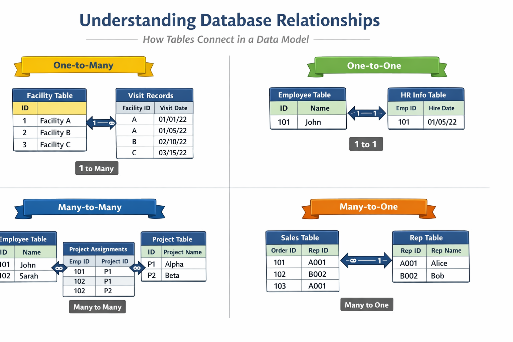

# The Star Schema: The Backbone of Analytical Models

Reliable analytics do not start with visuals or calculations. They start
with **structure**.

In Power BI and in all analytical systems, the structure that enables
clarity, consistency, and trust is the **star schema**.

The star schema is not a Power BI feature.It is a **data modeling
pattern** that predates modern BI tools and remains the foundation of
professional analytics.

Once you understand it, most modeling decisions become obvious.

------------------------------------------------------------------------

## What is a Star Schema ?

A **star schema** organizes data around a single central table of
events, surrounded by descriptive tables.

-   The **fact table** sits at the center

-   **Dimension tables** radiate outward

-   Relationships form a star-like shape

Each table has a single responsibility.

The star schema is:

-   A way of **thinking**

-   A way of **separating meaning**

-   A way of **protecting definitions**

It is **not**:

-   A Power BI layout trick

-   A performance hack

-   A cosmetic design choice

------------------------------------------------------------------------

## The Central Idea: Events Surrounded by Context

At the core of the star schema is a simple question:

> *What actually happened?*

The answer lives in the **fact table**.

Everything else exists to describe that answer.

------------------------------------------------------------------------

## Fact Tables: Recording Reality

A **fact table** records events as they occurred.

> Each row answers the question:

> “Something happened. What was it?”

Fact tables typically contain:

-   Identifiers (who, where, when)

-   Measurements (counts, flags, results)

They do **not** explain context in detail.

### Example: Health Service Delivery

In this book:

-   `fact_patient_visits` records service delivery events

-   One row equals one interaction between a patient and the health
    system

This table grows continuously over time and represents **measurable
reality**.

------------------------------------------------------------------------

## Dimension Tables: Stable Descriptions

A **dimension table** provides descriptive context for events.

> Each row answers the question:

> “What do we know about this entity?”

Dimension tables:

-   Change slowly

-   Contain descriptive attributes

-   Are reused across multiple analyses

Examples:

-   One row per patient

-   One row per facility

-   One row per calendar date

Dimensions do not record activity. They provide **meaning**.

------------------------------------------------------------------------

## Why Facts Should Not Contain Descriptions

A common beginner instinct is to “simplify” analysis by copying
descriptive fields into the fact table.

For example:

-   Facility name stored on every visit row

-   District repeated thousands of times

-   Patient age recalculated inconsistently

-   Month and year embedded as text

This creates three problems:

1.  **Redundancy** : The same information appears repeatedly.

2.  **Inconsistency** : Descriptions drift over time.

3.  **Fragility** : Small changes require rebuilding reports.

In a star schema:

-   Fact tables contain **keys and measurements**

-   Dimension tables contain **descriptions**

This separation protects historical meaning.

------------------------------------------------------------------------

## The Role of Keys: Connecting Meaning Without Carrying It

Relationships exist because tables share **keys**.

A key:

-   Uniquely identifies a record

-   Is stable over time

-   Has no analytical meaning itself

Good keys:

-   Patient IDs

-   Facility IDs

-   Date IDs

Bad keys:

-   Names

-   Labels

-   Descriptions

Keys exist to **connect meaning**, not to store it.

------------------------------------------------------------------------

## Relationships: How Meaning Flows

Relationships tell Power BI:

-   Which tables are connected

-   How filters propagate

-   Which tables control context

Without relationships, tables are isolated files. With correct
relationships, the model behaves predictably.

*One-to-Many: The Default Relationship*

In a star schema, relationships are almost always **one-to-many**.

Examples:

-   One patient → many visits

-   One facility → many visits

-   One date → many visits

In Power BI terms:

-   Dimension table = **one**

-   Fact table = **many**

This pattern mirrors reality and supports reliable aggregation.

```{=html}

```

------------------------------------------------------------------------

## Filter Direction: Why It Must Be One-Way

Relationships are directional.

In a well-designed star schema:

-   Filters flow from **dimension → fact**

-   Not from fact → dimension

This reflects real-world logic:

-   Selecting a district limits visits

-   Selecting a patient limits events

-   Selecting a date limits outcomes

> Note: Allowing filters to flow both ways introduces ambiguity and
> should be avoided unless there is a very specific, justified reason.

------------------------------------------------------------------------

## Why Dimensions Should Not Connect to Each Other

Another common mistake is linking dimension tables directly.

For example:

-   `dim_patient` linked to `dim_facility`

-   `dim_facility` linked to `dim_date`

This creates:

-   Multiple filter paths

-   Ambiguous context

-   Unpredictable results

In a star schema:

-   Dimensions connect **only to the fact table**

-   The fact table is the bridge between all context

If two dimensions need to interact, they do so **through events**.

------------------------------------------------------------------------

## Time as a First-Class Dimension

Time is not just a filter.

A date has structure:

-   Day

-   Month

-   Quarter

-   Year

-   Reporting period

-   Fiscal calendar

Embedding raw dates in fact tables limits analysis.

A dedicated date dimension enables:

-   Consistent aggregation

-   Year-over-year comparison

-   Alignment with reporting calendars

This is why professional models never rely on raw date fields alone.

------------------------------------------------------------------------

## Visualizing the Star (Mental Model)

Think of the model this way:

-   The fact table is the **question**
-   Dimensions are the **ways to slice the answer**

If you remove the fact table, nothing is left to analyze.

If you remove a dimension, analysis still works but just with less
context.

This is how you know the structure is correct.

### Star Schema Diagram (Conceptual)


------------------------------------------------------------------------


## Hands-On: Building the Star Schema in Power BI

This section translates the concepts you have learned into practical
modeling steps. Do not rush. Every action here reinforces the mental model you have just
developed.


**Step 1: Switch to Model View**

After completing data cleaning in Power Query:

1.  Close the Power Query Editor

2.  In Power BI Desktop, select the **Model View** icon from the left
    sidebar

You should see all imported tables displayed separately.

At this stage, Power BI may show suggested relationships. Do **not**
accept or rely on them yet.


------------------------------------------------------------------------

**Step 2: Classify Tables Before Creating Relationships**

Before dragging any fields, pause and classify each table using the
concepts from this chapter.

Using the datasets in this book:

-   **Fact table**
    -   `fact_patient_visits`
-   **Dimension tables**
    -   `dim_patient`
    -   `dim_facility`
    -   `dim_date`

Ask yourself:

-   Which table records events?

-   Which tables describe context?

If this is unclear, return to the earlier sections before proceeding.

------------------------------------------------------------------------


**Step 3: Identify Relationship Keys**

Each relationship requires a key that uniquely identifies a record in a
dimension table.

Confirm the following keys exist:

-   `dim_patient[patient_id]`
-   `dim_facility[facility_id]`
-   `dim_date[date_id]`

In the fact table, these same fields appear repeatedly as references.

> Reminder:\
> Keys connect meaning. They do not describe it.

------------------------------------------------------------------------

**Step 4: Create Dimension-to-Fact Relationships**

Create relationships manually to ensure correctness.

***Example: Patient to Visits***

1.  Drag `patient_id` from `dim_patient`

2.  Drop it onto `patient_id` in `fact_patient_visits`

In the relationship dialog, confirm (*see image below*):

\- Cardinality: **One-to-many**

\- Cross-filter direction: **Single**

\- Active relationship: **Yes**

Repeat the same process for: 

- `facility_id` → `dim_facility` 

- `date_id` → `dim_date`


------------------------------------------------------------------------


**Step 5: Enforce the Star Shape Visually**

Arrange tables in the Model View so that:

- `fact_patient_visits` sits at the center

- Dimension tables surround it

- No dimension table connects directly to another dimension


This visual layout is not cosmetic.\
It reinforces correct analytical thinking and simplifies
troubleshooting.

------------------------------------------------------------------------

**Step 6: Validate Filter Flow**

Before building visuals or calculations, test whether the model behaves
as expected.

1.  Switch to **Report View**

2.  Add a simple table visual

3.  Add:

    -   Facility Name (from `dim_facility`)
    -   Count of rows from `fact_patient_visits`

Now apply filters: 

- Select a district 

- Select a reporting period

If counts respond logically, filter flow is working correctly.

If not, return to Model View and review relationships.

------------------------------------------------------------------------

**Step 7: Hide Technical Fields (Optional but Recommended)**

Keys are essential for modeling but confusing for report users.

To hide them: 

1. Switch to **Data View** 

2. Right-click technical fields

such as: 

- `patient_id` 
- `facility_id` 
- `date_id` 

3. Select **Hide in report view**

This prevents accidental misuse during visualization.

------------------------------------------------------------------------

## Common Modeling Errors to Watch For

Most Power BI models do not fail loudly. They fail quietly. Numbers still appear, Charts still render, Filters still move but the logic underneath becomes unstable.

The following mistakes are responsible for the majority of “almost correct” dashboards in public health and M&E.


**1. Many-to-Many Relationships Created Unintentionally**

This is one of the most dangerous modeling errors because Power BI often allows it without warning.

***Why it happens***

Many-to-many relationships usually appear when:

- A dimension table contains duplicate keys
- A fact table is linked to another fact table
- Text fields are used as join keys
- Aggregated data is mixed with transaction-level data

In health data, this commonly happens when:

- Facility names are duplicated across systems
- Patient identifiers are inconsistent
- Monthly summaries are joined directly to line lists

**Why it is dangerous**

Many-to-many relationships:

- Inflate counts
- Distort totals
- Produce inconsistent results depending on filters
- Make DAX calculations unpredictable

The same indicator may return different values depending on where it is used.

**How to think your way out**

If a relationship is many-to-many, pause and ask:

- “What is the event?”
- “What is the description?”
- “Should these tables even be directly connected?”

In most cases, the solution is:

- Introduce or fix a dimension table
- Clean keys
- Revisit granularity

---

**2. Bi-Directional Filters Applied Without Justification**

Bi-directional filtering allows context to flow in both directions between tables.

It feels powerful.  
It is rarely necessary.

***Why it happens***

Users often enable bi-directional filters because:

- A visual “doesn’t work”
- A slicer does not behave as expected
- Power BI suggests it automatically

Instead of fixing structure, filters are allowed to flow both ways.

***Why it is dangerous***

Bi-directional filters:

- Create hidden filter paths
- Introduce ambiguity
- Make results dependent on visual layout
- Break assumptions in DAX measures

The model becomes difficult to reason about.

***How to think your way out***

In a star schema:

- Dimensions define context
- Facts respond to context

If you feel the need for bi-directional filters, it often means:
- The model is not truly star-shaped
- Tables are playing multiple roles
- A bridge table is missing

Fix structure before changing filter direction.

---

**3. Descriptive Fields Used as Relationship Keys**

Using names, labels, or descriptions as join fields is a common beginner shortcut.

It almost always leads to long-term problems.

***Why it happens***

Descriptive fields are:

- Human-readable
- Easy to recognize
- Available in every dataset

So they feel convenient.

***Why it is dangerous***

Descriptions:

- Change over time
- Are not guaranteed to be unique
- May be spelled inconsistently
- May include formatting differences

When a description changes, historical analysis breaks.

***How to think your way out***

Relationships should be built on:

- Stable identifiers
- Surrogate keys
- Fields with no business meaning

Descriptions belong in dimension tables.  
Keys exist only to connect.

---

**4. Dimension Tables Linked Directly to Each Other**

Linking dimension tables may feel logical, but it breaks analytical clarity.

***Why it happens***

This usually occurs when:

- Users try to “help” Power BI navigate context
- Dimensions share a common attribute
- The fact table feels unnecessary

***Why it is dangerous***

When dimensions link directly:

- Filter paths multiply
- Context becomes ambiguous
- Results depend on evaluation order
- Measures become fragile

Power BI can no longer determine a single, authoritative path.

***How to think your way out***

In a star schema:

- Dimensions never describe each other
- They describe events

If two dimensions need to interact, ask:

- “Where did this interaction occur?”
- “What event connects them?”

The answer almost always points back to the fact table.

---

## A Simple Rule to Remember

If your model:

- Is hard to explain
- Requires frequent filter overrides
- Produces inconsistent totals
- Breaks when visuals change

The problem is rarely DAX. It is almost always the model. Strong models make analytics boring. Weak models make analytics confusing.

This chapter exists to help you build the former.


## Reflection: Why This Step Matters

At this point, you have not created a single indicator or chart.

Yet you have already: 

- Defined how data flows 
- Controlled how context is applied 
- Protected future calculations from ambiguity

This is the difference between **building dashboards** and **building analytical systems**.

------------------------------------------------------------------------

## Stop Point: Do Not Move Forward Yet

Before proceeding to calculations, confirm:

-   There is exactly one central fact table
-   All dimensions connect only to the fact table
-   All relationships are one-to-many
-   Filter direction flows from dimension to fact

If any of these conditions are not met, fix them now.

------------------------------------------------------------------------

## What Comes Next

With a proper star schema in place, Power BI can now:

-   Understand context
-   Apply filters consistently
-   Support reusable indicator definitions

**The next chapter introduces *DAX measures*, where numerators and denominators are defined once and trusted everywhere.**

*A strong model makes DAX simpler. A weak model makes DAX fragile.*
