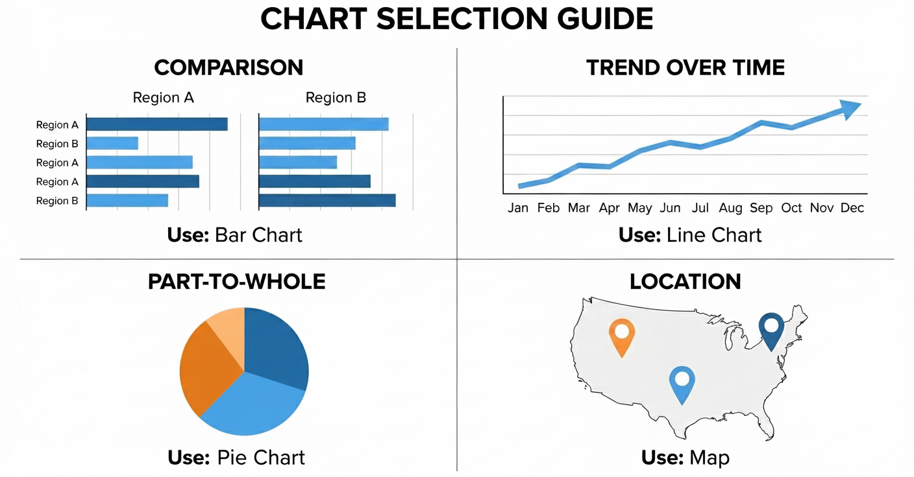

# Designing Dashboards People Actually Use

A dashboard is not an art project. It is a **decision-support tool**.

In Monitoring and Evaluation and Public Health, dashboards exist to answer questions, guide action, and surface risk. A visually impressive dashboard that does not support decisions has failed its purpose.

This chapter focuses on **choosing the right visual for the question being asked**, because the wrong visual can mislead even when the data and DAX are correct.

------------------------------------------------------------------------

## The 5-Second Rule

When a stakeholder opens a dashboard, they subconsciously ask one question:

> **"Are we on track?"**

If they cannot begin to answer that question within **five seconds**, the dashboard is too complex.

This does not mean removing detail. It means **prioritizing signal over noise**. The first screen should communicate status. Exploration can come later.

**Start With the Question, Not the Visual**

Before selecting any visual from the visualization pane, pause and ask:

-   What decision is this meant to support?
-   What comparison matters most?
-   What change should the user notice?

Different questions require different visual structures. There is no "best" visual in isolation.

## Layout Strategy: The Z-Pattern

Most people scan screens in a loose "Z" pattern, starting at the top-left and moving across and downward. A practical dashboard layout follows this pattern deliberately.

1.  **Top Left: Status Indicators (KPIs)**
    -   Use **Card Visuals** or **Multi-Row Cards**.
    -   High-level numbers that summarize performance (e.g., *Total Tested*, *Treatment Rate*).
    -   These answer "Are we on track?" immediately.
2.  **Top Right: Global Filters**
    -   Use **Slicers** for Time Period, Geography, Partner, or Donor.
    -   Placing them here allows users to frame the question before interpreting the numbers.
3.  **Middle Section: Trends and Comparisons**
    -   This is where the explanation happens.
    -   Trends over time (Line Charts) and comparisons across groups (Bar Charts) belong here.
4.  **Bottom Section: Detail and Evidence**
    -   Use **Matrix** or **Table** visuals.
    -   This is for users who want to inspect underlying data or export figures for their own reports.

A good layout reduces cognitive effort. Users should not have to "hunt" for meaning.

{width=100%}

## Choosing the Right Visual (The Most Important Skill)

Choosing the wrong visual does more harm than having no dashboard at all. Below are **decision-driven guidelines**, not aesthetic preferences.

### Visuals for Time-Based Questions

**Use when the question is:** "How is performance changing over time?"

**Best choice: Line Chart**

-   **Why:** Time is continuous. Direction matters. Trends (up/down) are easier to detect with a line than with bars.
-   **Good examples:** Monthly service uptake, Quarterly target achievement, Year-over-year comparison.
-   **Avoid:** Column charts for long time series (it looks like a barcode); Tables for trend interpretation.

> **Tip:** If the X-axis is time, your first instinct should always be a Line Chart.

### Visuals for Categorical Comparison

**Use when the question is:** "Which category is higher or lower?"

**Best choice: Bar Chart (Horizontal preferred)**

-   **Why:** Length is easier for the human eye to compare than area (pie charts) or angles. Labels are easier to read horizontally, especially long names like Districts or Facilities.
-   **Good examples:** Performance by District, Coverage by Facility, Uptake by Age Group.
-   **Avoid:** Pie charts (hard to compare slices); Stacked bars (if totals differ significantly).

> **Tip:** Always sort your bar charts. An unsorted chart is just a random list. A sorted chart is a leaderboard.

### Visuals for Ranking and Priority Setting

**Use when the question is:** "Who is performing best or worst?"

**Best choice: Sorted Bar Chart**

-   **Enhancements:** Sort Descending (Highest to Lowest) to show top performers, or Ascending to identify facilities needing support.
-   **This supports:** Resource allocation, targeted follow-up, and accountability discussions.

### Visuals for Composition (Parts of a Whole)

**Use when the question is:** "What makes up this total?"

**Best choices: Stacked Bar Chart or 100% Stacked Bar**

-   **Use Pie Charts ONLY when:** There are 2 or 3 categories (e.g., Male/Female) and differences are obvious.
-   **Avoid Pie Charts when:** There are many categories (e.g., 10 Districts) or values are close (49% vs 51%).

> **Rule of Thumb:** If users have to argue about which slice is bigger, the visual is wrong.

### Visuals for Geographic Patterns

**Use when the question is:** "Where is performance high or low?"

**Best choice: Map (Used carefully)**

Maps are powerful but dangerous.

-   **Use when:** Geography *itself* is the message (e.g., identifying a cluster of outbreaks).
-   **Avoid when:** Exact comparison is required. It is hard to compare the size of a bubble in the North vs a bubble in the South.
-   **Always pair maps with:** A bar chart or a table for precise comparison.

------------------------------------------------------------------------

## Why Tables Still Matter

Tables are not a failure of design. They are essential when:

-   Exact numbers matter (e.g., financial reporting or drug stock levels).
-   Data needs to be exported.
-   Users want to verify calculations.

**Power BI Tip:** Use the **Matrix** visual instead of the standard Table visual. The Matrix acts like an Excel Pivot Table, allowing users to drill down rows (e.g., click "Region" to expand "Districts") and aggregate columns. 

{width=80%}

---

## Avoiding Common Visualization Mistakes

Watch for these warning signs:

1.  **Too many visuals:** If it doesn't fit on one screen, it belongs on a new page.
2.  **Traffic Light Abuse:** Don't color everything Red/Green. It is overwhelming. Use color only to highlight exceptions (e.g., red for "Below 50% Target").
3.  **Pie Charts for Comparison:** Never use a pie chart to compare 15 districts.
4.  **KPIs without Context:** A number saying "5,000 Tested" means nothing. Is that good? Bad? Better than last month? Always provide context (e.g., "% of Target" or "vs Last Month").

------------------------------------------------------------------------

## Interaction Should Support Thinking

Interactivity is Power BI's superpower, but only when intentional.

-   **Cross-Highlighting:** Clicking a "Male" bar should filter the rest of the page to show Male data.
-   **Drill-Down:** Allow users to move from Summary to Detail (e.g., Year \> Quarter \> Month).
-   **Tooltips:** Use hover-over tooltips to provide extra detail without cluttering the screen.

> **Technical Tip:** If clicking one chart makes another chart look confusing, use the **"Edit Interactions"** button in the Format ribbon to turn off the interaction between those specific visuals.

------------------------------------------------------------------------

## A Simple Visual Selection Checklist

Before finalizing any visual, ask:

1.  What question does this visual answer?
2.  Is this the simplest visual that answers it?
3.  Can the message be understood in a few seconds?
4.  Would a table or bar chart be clearer?

If unsure, choose clarity over creativity.

Let's digress for a moment...

## Creating a Dedicated Measures Table (Strongly Recommended)

As dashboards grow, measures multiply quickly. Professional Power BI models store all calculations in a **single Measures table**.

This table:

-   Contains no data rows\
-   Has no relationships\
-   Exists only to organize logic

This pattern improves clarity, maintainability, and trust in your model.

------------------------------------------------------------------------

### Practical: Creating the Measures Table

1.  Go to the **Modeling** tab in Power BI Desktop\
2.  Click **New Table**\
3.  Enter the following DAX expression:

``` dax
Measure =
DATATABLE (
    "Placeholder", STRING,
    { { "Do not delete" } }
)
```

4.  Press **Enter**
5.  Rename the table to **"Indicators"**
6.  Create your first measure in this table:

``` dax
Total Tested = SUM ( fact_patient_visits[Number_Tested] )
```

7.  Repeat for all subsequent measures, ensuring they are created in the **Indicators** table.
8.  Hide the "Placeholder" column from report view to avoid accidental use by right-clicking on the placeholder column and select **Hide in report view**.

Your model now has a dedicated space for all calculations, making it easier to find and manage them as your dashboard evolves.And your indicator table should look like the image below:

{width=60%}

## Bonus: Measures Used in This Chapter

To complete the hands-on exercises in this chapter, create the following measures in the Measures table.

Total Patient Visits

``` dax
Total Patient Visits :=
COUNTROWS ( fact_patient_visits )
```

Total ART Clients

``` dax
Total ART Clients :=
CALCULATE (
    COUNTROWS ( fact_patient_visits ),
    fact_patient_visits[service_type] = "ART"
)
```

Malaria Tests Conducted

``` dax
Malaria Tests Conducted :=
CALCULATE (
    COUNTROWS ( fact_patient_visits ),
    fact_patient_visits[service_type] = "Malaria Test"
)
```

TB Tests Conducted

``` dax
TB Tests Conducted :=
CALCULATE (
    COUNTROWS ( fact_patient_visits ),
    fact_patient_visits[service_type] = "TB Test"
)
```

These measures are intentionally simple. Their purpose is to support visual reasoning, not advanced DAX patterns.

## Hands-On Practice: Choosing Visuals Deliberately

Use the measures above to complete the following exercises.

### Exercise 1: The 5-Second View

Create KPI Card visuals for:

-   Total Patient Visits
-   Total ART Clients
-   Malaria Tests Conducted
-   TB Tests Conducted

Place them in the top-left of the page.

Reflection: Can someone understand performance instantly?

### Exercise 2: Showing Direction Over Time

Create a Line Chart:

-   X-axis: Month or Quarter
-   Y-axis: Total Patient Visits

Observe how quickly trends become visible.

### Exercise 3: Comparing Facilities

Create a Horizontal Bar Chart:

-   Category: Facility
-   Value: Total Patient Visits
-   Sort descending

Now switch the visual to a **Pie Chart** and compare clarity.

### Exercise 4: Ranking for Action

Duplicate the bar chart and sort ascending to identify facilities needing support.

### Exercise 5: Using Maps Responsibly

Create a Map by district using Total Patient Visits.

Place it next to a **Bar Chart** showing the same measure.

Compare pattern recognition versus precision.

### Exercise 6: Supporting Trust With Tables

Create a Matrix visual with:

-   Rows: Region → District → Facility

-   Values:

    --Total Patient Visits

    -- Total ART Clients

Enable drill-down.

------------------------------------------------------------------------

## Avoiding Common Visualization Mistakes

Be alert to these warning signs:

-   Too many visuals on one page

-   Excessive red and green coloring

-   Pie charts used for comparison

-   KPIs without context

If a visual needs explanation, it is not doing its job.

### Interaction Should Support Thinking

-   Use interactivity intentionally:

-   Cross-highlighting to explore relationships

-   Drill-down to move from summary to detail

-   Tooltips to add depth without clutter

Disable confusing interactions using Edit Interactions when necessary.

### A Simple Visual Selection Checklist

Before finalizing any visual, ask:

-   What question does this answer?
-   Is this the simplest way to answer it?
-   Can it be understood in seconds?
-   Would a bar or table be clearer?

When in doubt, choose clarity over creativity.

## What to Carry Forward

Good dashboards are quiet. They do not shout. They do not impress with decoration. They communicate clearly and invite action.

When indicators are well defined and visuals are chosen deliberately, dashboards become trusted tools rather than presentation artifacts.

**The next chapter focuses on *Publishing and sharing dashboards* responsibly, ensuring that the right people see the right information at the right level of detail.**
